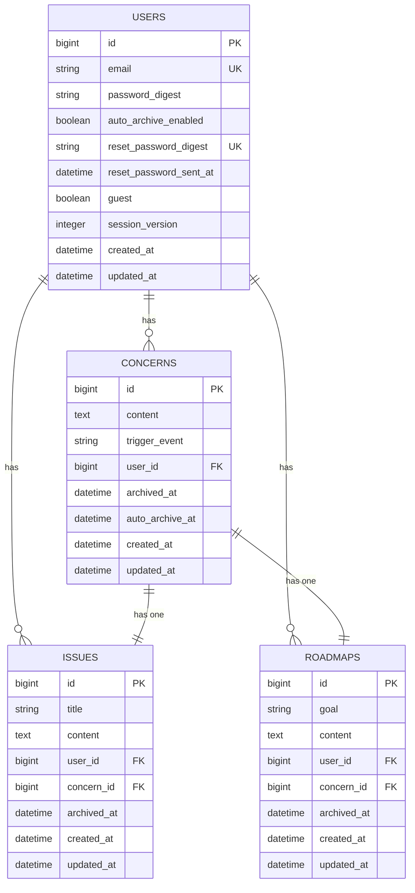

# なやみノート
> 書いて発見。書いて発展。そして、さっさと忘れよう。

## 目次
- [概要](#概要)
- [リンク](#リンク)
- [画面](#画面)
- [機能](#機能)
- [技術スタック](#技術スタック)
- [選定理由](#選定理由)
- [アーキテクチャ概要](#アーキテクチャ概要)
- [ER図](#er図)
- [プロダクト設計の判断](#プロダクト設計の判断)
- [セキュリティ上の工夫](#セキュリティ上の工夫)
- [今後実装したい機能](#今後実装したい機能)
- [ローカル環境構築手順](#ローカル環境構築手順)

<br>

## 概要
なやみノートは、頭の中で堂々巡りする悩みを書き出し、
構造化して整理するためのプロダクトです。

ToDoリストは「やること」が明確になった後のためのツールであり、
その手前のもやもやして不明瞭な悩みを抱えている人にはハードルが高くなっています。

なやみノートは、まずは悩みを書き出し、それから「問題」と「ロードマップ」に発展させることで、
考えがまとまらず何度も悩んでしまう状態から、前へ進める状態をつくります。

道筋が見えた悩みは、頭の中で抱え続けることなく手放すことができます。

<br>

## リンク
- プロダクト: https://rails-next-nayami-note.vercel.app/
- API: https://rails-next-nayami-note.onrender.com
- GitHub: https://github.com/reimurase/rails-next-nayami-note

<br>

## 画面

<br>

### サインアップ（ゲストログイン可能）


### なやみページ例


### 作成デモ


<br>

## 機能

| 機能 | 説明 |
|------|------|
| ユーザー登録・ログイン・ログアウト | メールアドレスとパスワードによる認証 |
| ゲストログイン | 登録不要ですぐに試せる |
| パスワードリセット | メールによるトークン認証でリセット |
| なやみの作成・編集・削除 | きっかけとなった出来事とともになやみを記録 |
| なやみのアーカイブ | 解消したなやみをアーカイブして手放す |
| 自動アーカイブ | 設定した日数（7日）後になやみを自動でアーカイブ |
| 問題の作成・編集・削除 | なやみから問題を抽出して整理 |
| ロードマップの作成・編集・削除 | 目標とそれを達成するためのステップを記録 |
| ライブラリ | アーカイブ済みのなやみ・問題・ロードマップの一覧 |

<br>

## 技術スタック

### バックエンド

- Ruby 3
- Rails 8 — API モード
- mysql2 — MySQL 互換アダプタ
- Solid Cache — DB ベースのキャッシュ
- Solid Queue - Active Jobのキューバックエンド
- bcrypt — パスワードハッシュ化

### フロントエンド

- Node.js 20
- Next.js 15 — App Router
- React 19
- TypeScript 5
- MUI（Material UI）
- SWR — データフェッチ・キャッシュ

### インフラ

- Vercel — フロントエンド（Next.js）のホスティング
- Render — バックエンド（Rails API）のホスティング（Docker デプロイ）
- TiDB Cloud — MySQL 互換のマネージド DB（本番、SSL 接続）
- Render Postgres — Solid Queue / Cache 用の DB（primary の TiDB とは分離、同一リージョンの内部接続）

### テスト・品質管理

- RSpec — Rails のテスト
- Jest + Testing Library — Next.js のテスト
- RuboCop — Ruby の静的解析・スタイル統一
- ESLint + Prettier — JS/TS の静的解析・整形

### その他

- Docker — マルチステージビルドによる本番イメージの軽量化
- GitHub Actions — CI（Rails / Next.js）

<br>

## 選定理由

<br>

### 選定方針

未経験の段階で技術間の細かな優劣を精査しても、判断の精度は上がりにくく効果が薄いと考えました。そのため選定には時間をかけず、実装と学習にリソースを回す方針を採りました。

条件は二つで、学習しやすさ（教材が豊富であること）と、実務で使われている、あるいは主要な概念が共通している技術であることです。この条件を満たす範囲での技術間の細かな優劣は重視していません。

### Rails API × Next.js の分離構成

フロントエンドとバックエンドを分離し、Rails は JSON API に専念、Next.js が UI を担う構成を採用しました。API とフロントを独立してデプロイ・スケールでき、実務で主流の構成である点を重視しました。

- **バックエンド（Rails）**：Active Record によるDB操作、認証、セッション管理など自作するための部品が標準で用意されているため、採用しました。
- **フロントエンド（Next.js）**：現在活発な React エコシステムの中で、ファイルベースのルーティングやビルド設定などフレームワークとしてのサポートが揃っており、未経験でも開発を進めやすいことが理由です。素の React ではこれらを自前で構築・管理する必要があります。

### TiDB Cloud

本番データベースに TiDB Cloud を採用しました。無料枠があり個人開発のコストを抑えられること、MySQL 互換で扱いやすいことが主な理由です。

MySQL 互換の範囲で利用しているため特定サービスへのロックインが弱く、将来 AWS（RDS / Aurora）などへ移行する際も載せ替えの負担が小さいと考えています。

### MUI（Material UI）

UI コンポーネントライブラリに MUI を採用しました。理由は二点あります。

一点目は、Dialog・Card・メニューなど必要なコンポーネントが揃っており、自前実装を減らせることです。

二点目は、デザインは今回の開発で優先度を高く置いていない領域であり、そこに時間をかけず一定の見た目を担保したかったことです。ロジックやデータモデリング、セキュリティ設計にリソースを集中させる判断として MUI を選びました。

<br>

## アーキテクチャ概要

<br>

### インフラ構成図（本番）


<br>

### リクエストの流れ

1. ユーザーのデバイスから Vercel 上の Next.js へ HTTPS でアクセスします。
2. Next.js は `/api/*` などのパスへのリクエストを、rewrites を通じて Render 上の Rails API へ転送します。ブラウザからは同一オリジンへのリクエストとして扱われます。
3. Rails API は TiDB Cloud（MySQL 互換）へ SSL 接続してデータを読み書きします。
4. パスワードリセットなどのメール送信は、Rails から Gmail SMTP 経由で行います。

<br>

### デプロイの流れ

1. developer が変更を GitHub の main ブランチへ push / merge します。
2. push をトリガーに GitHub Actions の CI（RSpec・RuboCop・ESLint・TypeScript typecheck・next-build・Jest）が実行されます。
3. Vercel（Next.js）は Deployment Checks を設定しており、フロント関連のジョブ（ESLint・TypeScript typecheck・next-build・Jest）が成功するまで本番への昇格をブロックします。
4. Render（Rails API）は Auto-Deploy を「After CI Checks Pass」に設定しており、CI 成功後にデプロイします。
5. CI が失敗した場合、フロント・バックともに本番へは反映されません。

<br>

## ER図

データ構造は user を起点に、concern → issue・roadmap という展開で成り立っています。

- **user と各テーブルは 1:多**：一人の user が複数の concern・issue・roadmap を持ちます。
- **concern と issue・roadmap は 1:1**：一つの concern に対して issue・roadmap がそれぞれ一つ対応します。曖昧な悩み（concern）を、問題（issue）とロードマップ（roadmap）へ展開する構造を表しています。
- **issue・roadmap は user_id を直接持つ**：concern 経由でも user にたどれますが、concern を介さず user 単位で直接クエリできるよう user_id を保持しています。
- **archived_at による論理削除**：concern・issue・roadmap は物理削除せず archived_at で論理削除し、ライブラリ機能として扱います。

<br>



<br>

## プロダクト設計の判断

<br>

### なやみを起点にした1対1の階層構造

当初、なやみノートは「なやみ」、「問題」、「ロードマップ」のどこからでも始められ、関連付けができることを想定していました。人の悩みは必ずしも、もやもやした曖昧な悩みから始まるわけではないため、思考の自由さをできるだけ阻害しない設計にしたかったからです。

しかし、起点や関連付けの自由度が高いと、どこから始めるかやどれと関連付けるかという判断や選択に思考が奪われてしまうことに気づきました。そうであるならば、多少自由度を制限したとしても、道筋を示して、一つのことに集中できる方が、方向性としては合っていると考えました。そのため、なやみを起点にした1対1の階層構造に絞り、問題やロードマップはなやみからしかつくれないUIにしました。

### 自動アーカイブによる「忘れる」の仕組み化

悩みは時間経過によって価値が薄れて忘れていきます。これをサービス上でも再現したいと考えました。

ほとんどのサービスでは悩みや問題が溜まっていき、整理する必要が出てきます。それを自動で行うようにできれば、整理に時間やコストを奪われることなく、より自然な状態で悩みを手放すことができます。

なやみは1週間後にライブラリへ移動する機能を実装しました。index の取得時に指定時間を超えたなやみを検索して、更新しています。将来的には、裏側でライブラリへ移動するようにしていきます。

<br>


## セキュリティ上の工夫

<br>

### レート制限

認証エンドポイントは email + password のみで認証するため、総当たり攻撃への耐性をレート制限で補強しています。あわせて過剰リクエストによる DB 負荷の抑制も目的としています。

制限はメールアドレス単位（主防御）と IP 単位（副次防御）の二層で設計しています。

**既知の制約**：本番環境（Render）は多段プロキシ構成のため、`request.remote_ip` が実クライアントIPを返しません。このため IP 単位の制限は実効性を持たず、現状はメールアドレス単位を主防御として運用しています。

**対応方針**：AWS 移行時に ALB を経由する構成へ変更し、VPC 内の既知IP範囲を trusted proxy として扱うことで `remote_ip` の解決を正常化します。これにより IP 単位を副次防御として機能させます。

<br>

### GitHub Actions で参照するアクションをコミットSHAで固定

アクションをGitタグやブランチで指定すると、その指定は可変な参照となり、指し先のコミットを後から書き換えられる余地があります。

仮に、アクション提供元のリポジトリが乗っ取られ、タグの参照先が悪意のあるコミットに書き換えられた場合、悪意あるコードが実行されてしまいます。

対策として、`pinact`を導入してアクション参照先のコミットをSHAで固定しました。

また、参照するコミット先を固定するとバージョン更新の恩恵を受けられないため、`dependabot`を導入して安全性を担保したまま、更新できるようにしました。

<br>

### タイミング攻撃対策

メールアドレスが未登録の場合と登録済みの場合で、パスワード照合処理の有無により応答時間に差が出ます。この差から、攻撃者はメールアドレスの登録有無を推測できます（タイミング攻撃）。

原因は、メールアドレスが登録されていない場合に即座にエラーを返しており、パスワード照合を行う成功時との間で処理時間に差が生じていたことです。ダミーの bcrypt 照合を挟むことで、失敗時もパスワード照合分の時間を待ってからエラーを返し、応答時間を揃えて対策しました。

<br>

### session_version によるセッション無効化

パスワードを再設定しても古いセッション Cookie が有効なままで、悪意のある他者がそれをそのまま利用できる状態になっていました。

原因は、パスワード再設定後に古いセッションを無効化する処理を実装していなかったことです。再設定後に `session_version` をインクリメントし、`session_version` が一致しないセッション Cookie をすべて無効化するよう実装しました。

---

そのほか、**CSRF対策**（SameSite=Lax + CSRFトークン）を実装しています。

<br>

## 今後実装したい機能
- AWSへの移行
- 本番相当のセキュリティ拡張（IDaaSの導入によるMFA・パスキー対応など）
- アーカイブUIの実装（日付軸・アルバム形式）

<br>

## ローカル環境構築手順

### Docker を使う場合（推奨）

#### 前提
- Docker / Docker Compose
- mkcert

#### 1. リポジトリをクローン

```bash
git clone https://github.com/reimurase/rails-next-nayami-note.git
cd rails-next-nayami-note
```

#### 2. 環境変数を設定

```bash
cp .env.example .env
```

`.env` を編集して `DB_PASSWORD` に任意のパスワードを設定します。

```
DB_PASSWORD=yourpassword
DB_NAME_DEV=nayami_note_development
DB_NAME_TEST=nayami_note_test
```

#### 3. 証明書を生成（mkcert）

ローカル CA を信頼ストアに登録します（初回のみ）。

```bash
mkcert -install
```

プロジェクトのルートで証明書を生成します。

```bash
mkdir -p next/certificates
mkcert -key-file next/certificates/localhost-key.pem -cert-file next/certificates/localhost.pem localhost 127.0.0.1 ::1
```

`localhost.pem`（証明書）と `localhost-key.pem`（秘密鍵）が生成され、`compose.yml` でコンテナにマウントされます。

> 秘密鍵は `.gitignore` 済みです。証明書はリポジトリで共有せず、各自の環境で生成してください。

#### 4. イメージをビルド

```bash
docker compose build
```

#### 5. DB のセットアップ

```bash
docker compose run --rm rails rails db:create db:schema:load db:seed
```

#### 6. 起動

```bash
docker compose up
```

ブラウザで `https://localhost:3001` にアクセスします。

> mkcert の証明書が信頼済みのため、警告は出ません。

---

<details>
<summary>手動セットアップ（Docker を使わない場合）</summary>

#### 前提
- Ruby 3.4.6
- Node.js 20.18.0
- MySQL 9.4.0
- mkcert

#### 1. リポジトリをクローン

```bash
git clone https://github.com/reimurase/rails-next-nayami-note.git
cd rails-next-nayami-note
```

#### 2. 証明書を生成（mkcert）

ローカル CA を信頼ストアに登録し（初回のみ）、証明書を生成します。

```bash
mkcert -install
mkdir -p next/certificates
mkcert -key-file next/certificates/localhost-key.pem -cert-file next/certificates/localhost.pem localhost 127.0.0.1 ::1
```

`localhost.pem` と `localhost-key.pem` が生成されます（秘密鍵は `.gitignore` 済み、各自の環境で生成）。

#### 3. Rails セットアップ

```bash
cd rails
bundle install
```

`config/master.key` を用意した上で、必要に応じて環境変数を設定します（デフォルトは `root` / パスワードなし / `127.0.0.1:3306`）。

```bash
rails db:create db:schema:load db:seed
```

#### 4. Next.js セットアップ

```bash
cd ../next
npm install
```

`.env.local` を作成します。

```
API_BASE_URL=http://localhost:3000
```

#### 5. 起動

ターミナルを2つ使って、それぞれ起動します。

```bash
# Rails（ポート 3000）
cd rails
rails s
```

```bash
# Next.js（ポート 3001）
cd next
npm run dev
```

ブラウザで `https://localhost:3001` にアクセスします。

> mkcert の証明書が信頼済みのため、警告は出ません。

</details>