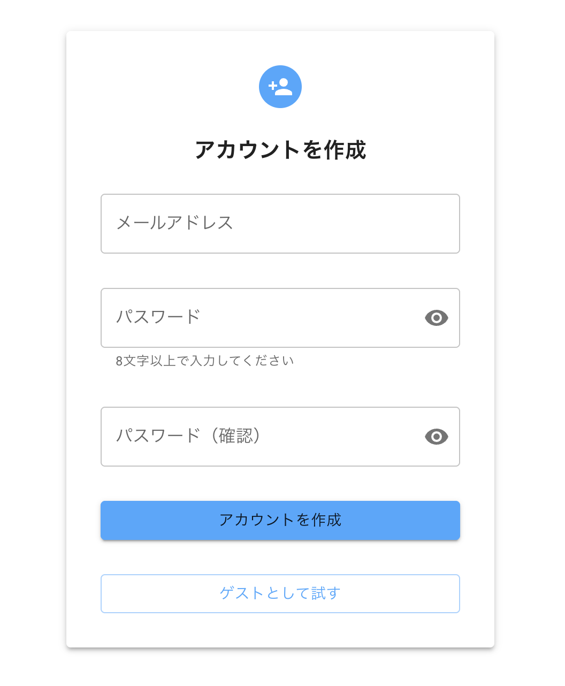
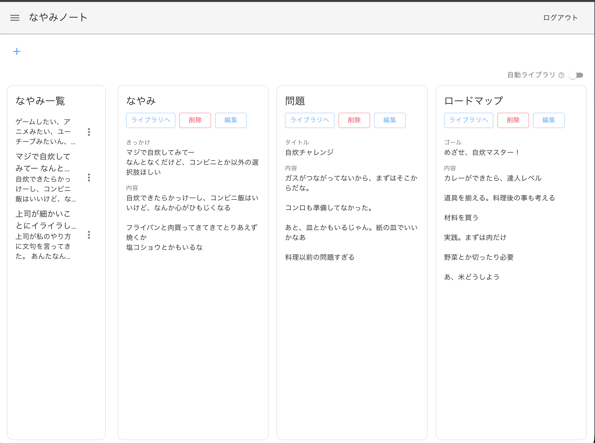
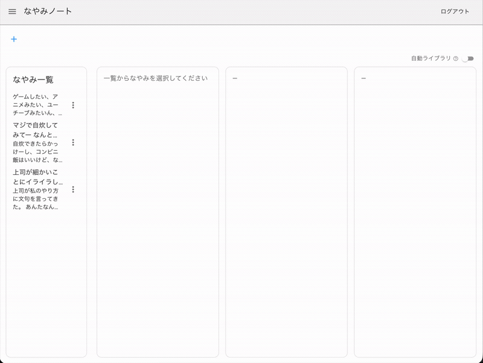
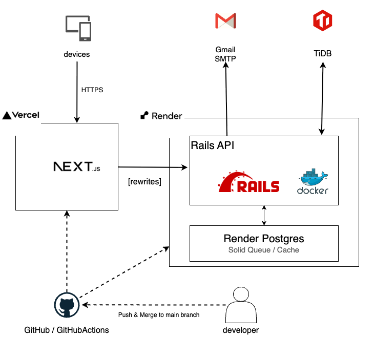
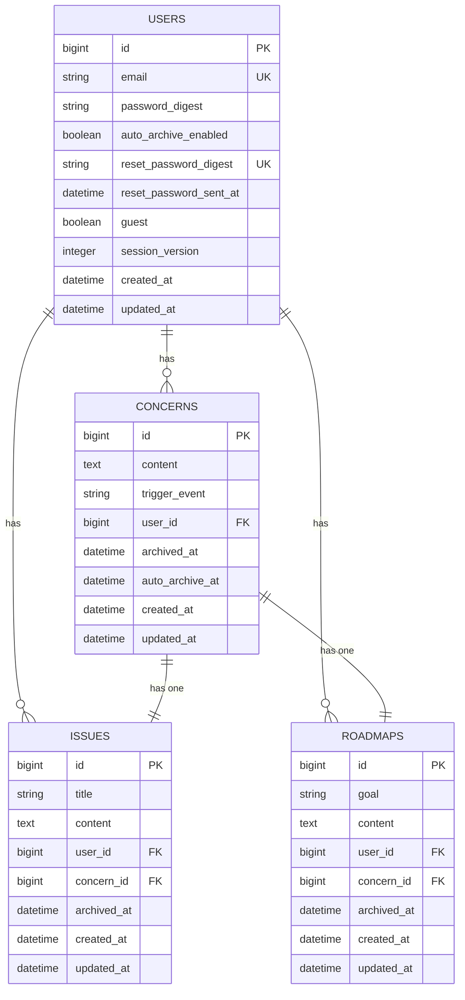

# なやみノート
> 書いて発見。書いて発展。そして、さっさと忘れよう。

## 概要
なやみノートは、頭の中で堂々巡りする悩みを書き出し、
構造化して整理するためのプロダクトです。

ToDoリストは「やること」が明確になった後のためのツールであり、
その手前のもやもやして不明瞭な悩みを抱えている人にはハードルが高くなっています。

なやみノートは、まずは悩みを書き出し、それから「問題」と「ロードマップ」に発展させることで、
考えがまとまらず何度も悩んでしまう状態から、前へ進める状態をつくります。

道筋が見えた悩みは、頭の中で抱え続けることなく手放すことができます。

## リンク
- プロダクト: https://rails-next-nayami-note.vercel.app/
- API: https://rails-next-nayami-note.onrender.com
- Github: https://github.com/reimurase/rails-next-nayami-note

## 画面
### サインアップ（ゲストログイン可能）



### なやみページ例



### 作成デモ



## 機能

| 機能 | 説明 |
|------|------|
| ユーザー登録・ログイン・ログアウト | メールアドレスとパスワードによる認証 |
| ゲストログイン | 登録不要ですぐに試せる |
| パスワードリセット | メールによるトークン認証でリセット |
| なやみの作成・編集・削除 | きっかけとなった出来事とともになやみを記録 |
| なやみのアーカイブ | 解消したなやみをアーカイブして手放す |
| 自動アーカイブ | 設定した日数（7日）後になやみを自動でアーカイブ |
| 問題の作成・編集・削除 | なやみから問題を抽出して整理 |
| ロードマップの作成・編集・削除 | 目標とそれを達成するためのマイルストーンを記録 |
| ライブラリ | アーカイブ済みのなやみ・問題・ロードマップの一覧 |

## 技術スタック

### バックエンド

- Ruby 3
- Rails 8 — API モード
- mysql2 — MySQL 互換アダプタ
- Solid Cache — DB ベースのキャッシュ／セッションストア
- bcrypt — パスワードハッシュ化

### フロントエンド

- Node.js 20
- Next.js 15 — App Router
- React 19
- TypeScript 5
- MUI（Material UI）
- SWR — データフェッチ・キャッシュ

### インフラ

- Vercel — フロントエンド（Next.js）のホスティング
- Render — バックエンド（Rails API）のホスティング（Docker デプロイ）
- TiDB Cloud — MySQL 互換のマネージド DB（本番、SSL 接続）

### テスト・品質管理

- RSpec — Rails のテスト
- Jest + Testing Library — Next.js のテスト
- RuboCop — Ruby の静的解析・スタイル統一
- ESLint + Prettier — JS/TS の静的解析・整形

### その他

- Docker — マルチステージビルドによる本番イメージの軽量化
- GitHub Actions — CI（Rails / Next.js）

## 選定理由

### Rails API × Next.js の分離構成

フロントエンドとバックエンドを分離し、Rails は JSON API に専念、Next.js が UI を担う構成を採用した。API とフロントを独立してデプロイ・スケールでき、責務が明確になる。実務で主流の構成であり、この分離をゼロから設計・実装できることで自走力を示す狙いもある。

- **バックエンド（Rails）**：未経験向けの教材が豊富で独学で体系的に学びやすく、求人数も多い。Active Record によるDB操作、認証、セッション管理などWebアプリに必要な機能が標準で揃っており、一人での開発を進めやすい。
- **フロントエンド（Next.js）**：現在活発な React エコシステムの中で、ファイルベースのルーティングやビルド設定などフレームワークとしてのサポートが揃っており、初心者でも一人で開発を進めやすい。素の React ではこれらを自前で構築・管理する必要がある。

### TiDB Cloud

本番データベースに TiDB Cloud を採用した。無料枠があり個人開発のコストを抑えられること、MySQL 互換で扱いやすいことが主な理由。

MySQL 互換の範囲で利用しているため特定サービスへのロックインが弱く、将来 AWS（RDS / Aurora）などへ移行する際も載せ替えの負担が小さいと考えている。

### SWR

データ取得ライブラリに SWR を採用した。導入当初に明確な比較検討をしたわけではないが、結果として以下の役割を担っている。

- **コンポーネント間のデータ共有（認証状態）**：`"me"` キーで、fetcher を持たず既存キャッシュを読むだけの参照を行い、認証情報を複数コンポーネントで共有する。props で受け渡さずに同じ値を参照でき、更新時は `mutate("me")` で再検証する。
- **一覧の取得・キャッシュ・更新反映（concern / issue / roadmap）**：一覧データを取得・キャッシュし、子コンポーネントには props で渡す。作成・更新時は子から渡したコールバック（`onCreated` など）経由で `mutate` を呼び、再取得して表示を更新する。

### MUI（Material UI）

UI コンポーネントライブラリに MUI を採用した。理由は二点。Dialog・Card・メニューなど必要なコンポーネントが揃っており、自前実装を減らせること。もう一点は、デザインは今回の開発で優先度を高く置いていない領域であり、そこに時間をかけず一定の見た目を担保したかったこと。ロジックやデータモデリング、セキュリティ設計にリソースを集中させる判断として MUI を選んだ。

## アーキテクチャ概要

### 本番（production）

### リクエストの流れ

1. ユーザーのデバイスから Vercel 上の Next.js へ HTTPS でアクセスする。
2. Next.js は `/api/*` などのパスへのリクエストを、rewrites を通じて Render 上の Rails API へ転送する。ブラウザからは同一オリジンへのリクエストとして扱われる。
3. Rails API は TiDB Cloud（MySQL 互換）へ SSL 接続してデータを読み書きする。
4. パスワードリセットなどのメール送信は、Rails から Gmail SMTP 経由で行う。

### デプロイの流れ

1. developer が変更を GitHub の main ブランチへ push / merge する。
2. push をトリガーに GitHub Actions の CI（RSpec・RuboCop・ESLint・TypeScript typecheck・next-build・Jest）が実行される。
3. Vercel（Next.js）は Deployment Checks を設定しており、フロント関連のジョブ（ESLint・TypeScript typecheck・next-build・Jest）が成功するまで本番への昇格をブロックする。
4. Render（Rails API）は Auto-Deploy を「After CI Checks Pass」に設定しており、CI 成功後にデプロイする。
5. CI が失敗した場合、フロント・バックともに本番へは反映されない。

### インフラ構成図



## ER図

データ構造は user を起点に、concern → issue・roadmap という展開で成り立っている。

- **user と各テーブルは 1:多**：一人の user が複数の concern・issue・roadmap を持つ。
- **concern と issue・roadmap は 1:1**：一つの concern に対して issue・roadmap がそれぞれ一つ対応する。曖昧な悩み（concern）を、問題（issue）とロードマップ（roadmap）へ展開する構造を表す。
- **issue・roadmap は user_id を直接持つ**：concern 経由でも user にたどれるが、concern を介さず user 単位で直接クエリできるよう user_id を保持している。
- **archived_at による論理削除**：concern・issue・roadmap は物理削除せず archived_at で論理削除し、ライブラリ機能として扱う。



## プロダクト設計の判断

### なやみを起点にした1対1の階層構造

当初、なやみノートは「なやみ」、「問題」、「ロードマップ」のどこからでも始められ、関連付けができることを想定していた。人の悩みは必ずしも、もやもやした曖昧ななやみから始まるわけではないため、思考の自由さをできるだけ阻害しない設計にしたかった。

しかし、起点や関連付けの自由度が高いと、どこから始めるかやどれと関連付けるかという判断や選択に思考が奪われてしまうことに気づいた。そうであるならば、多少自由度を制限したとしても、道筋を示して、一つのことに集中できる方が、方向性としてはあっていると考えた。そのため、なやみを起点にした1対1の階層構造に絞り、問題やロードマップはなやみからしかつくれないUIにした。

### 自動アーカイブによる「忘れる」の仕組み化

悩みは時間経過によって価値が薄れて忘れていきます。これをサービス上でも再現したいと考えました。ほとんどのサービスでは悩みや問題が溜まっていき、整理する必要が出てきます。それを自動で行うようにできれば、整理に時間やコストを奪われることなく、より自然な状態で悩みを手放すことができます。なやみは１週間後にライブラリへ移動する機能を実装しました。indexの取得時に指定時間を越えたなやみを検索して、更新しています。将来的には、裏側でライブラリへ移動するようにしていきます。

## セキュリティ上の工夫

### レート制限

認証エンドポイントは email + password のみで認証するため、総当たり攻撃への耐性を
レート制限で補強している。あわせて過剰リクエストによる DB 負荷の抑制も目的とする。

制限は二層で設計している。

- **メールアドレス単位**（主防御）: 同一アカウントへの試行を制限
- **IP 単位**（副次防御）: 同一クライアントからの試行を制限

**既知の制約**: 本番環境（Render）は多段プロキシ構成のため、`request.remote_ip` が
実クライアントIPを返さない。このため IP 単位の制限は実効性を持たず、現状は
メールアドレス単位を主防御として運用している。

**対応方針**: AWS 移行時に ALB を経由する構成へ変更し、VPC 内の既知IP範囲を
trusted proxy として扱うことで `remote_ip` の解決を正常化する。これにより
IP 単位を副次防御として機能させる。

### タイミング攻撃対策

メールアドレスが未登録の場合と登録済みの場合で、パスワード照合処理の有無により応答時間に差が出る。この差から、攻撃者はメールアドレスの登録有無を推測できる（タイミング攻撃）。

原因は、メールアドレスが登録されていない場合に即座にエラーを返しており、パスワード照合を行う成功時との間で処理時間に差が生じていたこと。ダミーの bcrypt 照合を挟むことで、失敗時もパスワード照合分の時間を待ってからエラーを返し、応答時間を揃えて対策した。

応答時間の差が情報漏洩につながること、対策には成功・失敗で処理時間を揃える必要があることを理解した。

### session_version によるセッション無効化

パスワードを再設定しても古いセッション Cookie が有効なままで、悪意のある他者がそれをそのまま利用できる状態になっていた。

原因は、パスワード再設定後に古いセッションを無効化する処理を実装していなかったこと。再設定後に `session_version` をインクリメントし、`session_version` が一致しないセッション Cookie をすべて無効化するよう実装した。

認証情報の変更時には、データを更新するだけでなく既存セッションの破棄も必要だと理解した。この考えはログアウトやアカウント削除でも応用できる。

## 今後実装したい機能
- AWSへの移行
- 本番相当のセキュリティ拡張（IDaaSの導入によるMFA・パスキー対応など）
- アーカイブUIの実装（日付軸・アルバム形式）

## ローカル環境構築手順

### Docker を使う場合（推奨）

#### 前提
- Docker / Docker Compose

#### 1. リポジトリをクローン

```bash
git clone https://github.com/reimurase/rails-next-nayami-note.git
cd rails-next-nayami-note
```

#### 2. 環境変数を設定

```bash
cp .env.example .env
```

`.env` を編集して `DB_PASSWORD` に任意のパスワードを設定します。

```
DB_PASSWORD=yourpassword
DB_NAME_DEV=nayami_note_development
DB_NAME_TEST=nayami_note_test
```

#### 3. イメージをビルド

```bash
docker compose build
```

#### 4. DB のセットアップ

```bash
docker compose run --rm rails rails db:create db:migrate db:seed
```

#### 5. 起動

```bash
docker compose up
```

ブラウザで `https://localhost:3001` にアクセスします。

> Next.js は HTTPS で起動するため、初回はオレオレ証明書の警告が出ます。「詳細設定 → 続行」を選択してください。

---

<details>
<summary>手動セットアップ（Docker を使わない場合）</summary>

#### 前提
- Ruby 3.4.6
- Node.js 20.18.0
- MySQL 9.4.0

#### 1. リポジトリをクローン

```bash
git clone https://github.com/reimurase/rails-next-nayami-note.git
cd rails-next-nayami-note
```

#### 2. Rails セットアップ

```bash
cd rails
bundle install
```

`config/master.key` を用意した上で、必要に応じて環境変数を設定します（デフォルトは `root` / パスワードなし / `127.0.0.1:3306`）。

```bash
rails db:create db:migrate db:seed
```

#### 3. Next.js セットアップ

```bash
cd ../next
npm install
```

`.env.local` を作成します。

```
NEXT_PUBLIC_API_BASE_URL=https://localhost:3000
API_BASE_URL=https://localhost:3000
```

#### 4. 起動

ターミナルを2つ使って、それぞれ起動します。

```bash
# Rails（ポート 3000）
cd rails
rails s
```

```bash
# Next.js（ポート 3001）
cd next
npm run dev
```

ブラウザで `https://localhost:3001` にアクセスします。

> Next.js は `--experimental-https` で起動するため、初回はオレオレ証明書の警告が出ます。ブラウザで「詳細設定 → 続行」を選択してください。

</details>
