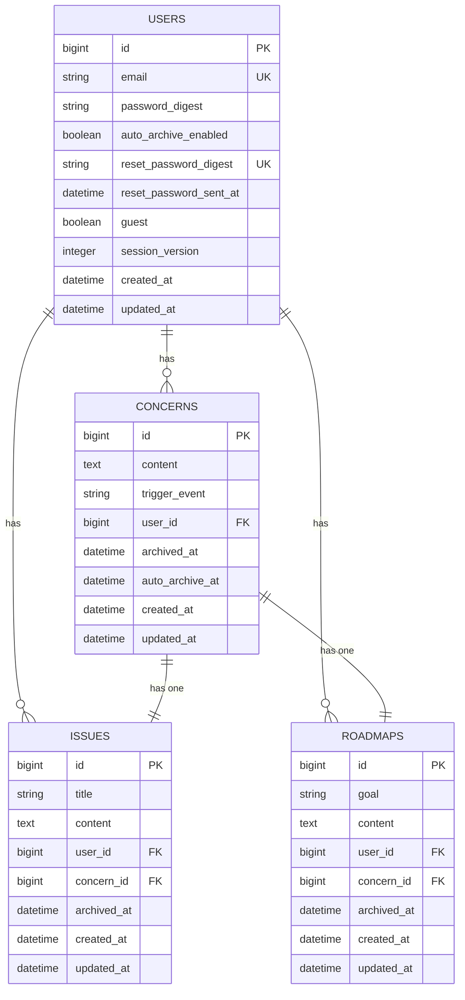

# なやみノート
> 書いて発見。書いて発展。そして、さっさと忘れよう。

## 概要
なやみノートは、頭の中で堂々巡りする悩みを書き出し、
構造化して整理するためのプロダクトです。

ToDoリストは「やること」が明確になった後のためのツールであり、
その手前のもやもやして不明瞭な悩みを抱えている人にはハードルが高くなっています。

なやみノートは、まずは悩みを書き出し、それから「問題」と「ロードマップ」に発展させることで、
考えがまとまらず何度も悩んでしまう状態から、前へ進める状態をつくります。
道筋が見えた悩みは、頭の中で抱え続けることなく手放すことができます。

## リンク
- プロダクト: https://rails-next-nayami-note.vercel.app/
- API: https://rails-next-nayami-note.onrender.com
- Github: https://github.com/reimurase/rails-next-nayami-note

## 画面
サインアップ（ゲストログイン可能）


なやみページ例


作成過程


## 機能

| 機能 | 説明 |
|------|------|
| ユーザー登録・ログイン・ログアウト | メールアドレスとパスワードによる認証 |
| ゲストログイン | 登録不要ですぐに試せる |
| パスワードリセット | メールによるトークン認証でリセット |
| なやみの作成・編集・削除 | きっかけとなった出来事とともになやみを記録 |
| なやみのアーカイブ | 解消したなやみをアーカイブして手放す |
| 自動アーカイブ | 設定した日数（7日）後になやみを自動でアーカイブ |
| 問題の作成・編集・削除 | なやみから問題を抽出して整理 |
| ロードマップの作成・編集・削除 | 目標とそれを達成するためのマイルストーンを記録 |
| ライブラリ | アーカイブ済みのなやみ・問題・ロードマップの一覧 |

## 技術スタック

### バックエンド

| 技術 | バージョン |
|------|-----------|
| Ruby | 3.4.6 |
| Ruby on Rails | 8.0.3 |
| MySQL | 9.4.0 |
| Puma | ~6.4 |
| bcrypt（has_secure_password） | ~3.1 |
| rack-cors | - |

### フロントエンド

| 技術 | バージョン |
|------|-----------|
| Node.js | 20.18.0 |
| Next.js | 15.5.9 |
| React | 19.1.0 |
| TypeScript | ~5.6.3 |
| MUI（Material UI） | 7.3.5 |
| Axios | 1.13.2 |
| SWR | 2.3.6 |

### インフラ

### テスト・開発

| 技術 | 用途 |
|------|------|
| RSpec | Rails のテスト |
| Jest + Testing Library | Next.js のテスト |
| GitHub Actions | CI（Rails / Next.js） |

## アーキテクチャ概要
ER図


## 工夫した点
なやみを起点にした1対1の階層構造

当初、なやみノートはなやみ、問題、ロードマップのどこからでも始められて、関連付けができることを想定していた。人の悩みは必ずしも、もやもやした曖昧ななやみから始まるわけではないから、思考の自由さをできるだけ阻害しないようにと考えた。

しかし、起点や関連付けの自由度が高いと、どこから始めるかやどれと関連付けるかという管理に思考が奪われてしまうことに気づいた。だとすると、多少自由度を制限したとしても、道筋を示して、一つのことに集中できる方が、方向性としてはあっていると考えた。そのため、なやみを起点にした1対1の階層構造に絞り、問題やロードマップはなやみからしかつくれないUIにした。

自動アーカイブによる「忘れる」の仕組み化

悩みは時間経過によって価値が薄れて流れていきます。これをサービス上でも再現したいと考えました。ほとんどのサービスでは悩みや問題が溜まっていき、整理する必要が出てきます。それを自動で行うようにできれば、整理に時間やコストを奪われることなく、より自然な状態で悩みを手放すことができます。なやみは１週間後にライブラリへ移動する機能を実装しました。indexの取得時に指定時間を越えたなやみを検索して、更新しています。将来的には、裏側でライブラリへ移動するようにしていきます。

## 今後実装したい機能
AWSへの移行
本番相当のセキュリティ拡張（IDaaSの導入によるMFA・パスキー対応など）
アーカイブUIの実装（日付軸・アルバム形式）

## ローカル環境構築手順

### Docker を使う場合（推奨）

#### 前提
- Docker / Docker Compose

#### 1. リポジトリをクローン

```bash
git clone https://github.com/reimurase/rails-next-nayami-note.git
cd rails-next-nayami-note
```

#### 2. 環境変数を設定

```bash
cp .env.example .env
```

`.env` を編集して `DB_PASSWORD` に任意のパスワードを設定します。

```
DB_PASSWORD=yourpassword
DB_NAME_DEV=nayami_note_development
DB_NAME_TEST=nayami_note_test
```

#### 3. イメージをビルド

```bash
docker compose build
```

#### 4. DB のセットアップ

```bash
docker compose run --rm rails rails db:create db:migrate db:seed
```

#### 5. 起動

```bash
docker compose up
```

ブラウザで `https://localhost:3001` にアクセスします。

> Next.js は HTTPS で起動するため、初回はオレオレ証明書の警告が出ます。「詳細設定 → 続行」を選択してください。

---

<details>
<summary>手動セットアップ（Docker を使わない場合）</summary>

#### 前提
- Ruby 3.4.6
- Node.js 20.18.0
- MySQL 9.4.0

#### 1. リポジトリをクローン

```bash
git clone https://github.com/reimurase/rails-next-nayami-note.git
cd rails-next-nayami-note
```

#### 2. Rails セットアップ

```bash
cd rails
bundle install
```

`config/master.key` を用意した上で、必要に応じて環境変数を設定します（デフォルトは `root` / パスワードなし / `127.0.0.1:3306`）。

```bash
rails db:create db:migrate db:seed
```

#### 3. Next.js セットアップ

```bash
cd ../next
npm install
```

`.env.local` を作成します。

```
NEXT_PUBLIC_API_BASE_URL=https://localhost:3000
API_BASE_URL=https://localhost:3000
```

#### 4. 起動

ターミナルを2つ使って、それぞれ起動します。

```bash
# Rails（ポート 3000）
cd rails
rails s
```

```bash
# Next.js（ポート 3001）
cd next
npm run dev
```

ブラウザで `https://localhost:3001` にアクセスします。

> Next.js は `--experimental-https` で起動するため、初回はオレオレ証明書の警告が出ます。ブラウザで「詳細設定 → 続行」を選択してください。

</details>
